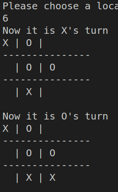

# Tic Tac Toe With MinMax using Dlang

### 1. About

This is a Tic Tac Toe game written in [Dlang](https://dlang.org/. This game support human player play with human player and human player play with computer player. This game use `MinMax` algorithm as the AI algorithm to guide the computer player. In order to make the game fun. There will be 60% chance that the computer player will follow the `MinMax` algorithm's guide and 40% chance it will randomly choose a legal move.

### 2. How to run

- Git clone this repository.
- Set up dlang environment.
- Use `dub build` and `dub run` to play.

`./tic-tac-toe` is build with `Kali Linux`

### 3. Example

- Play with human player

- Play with computer player

